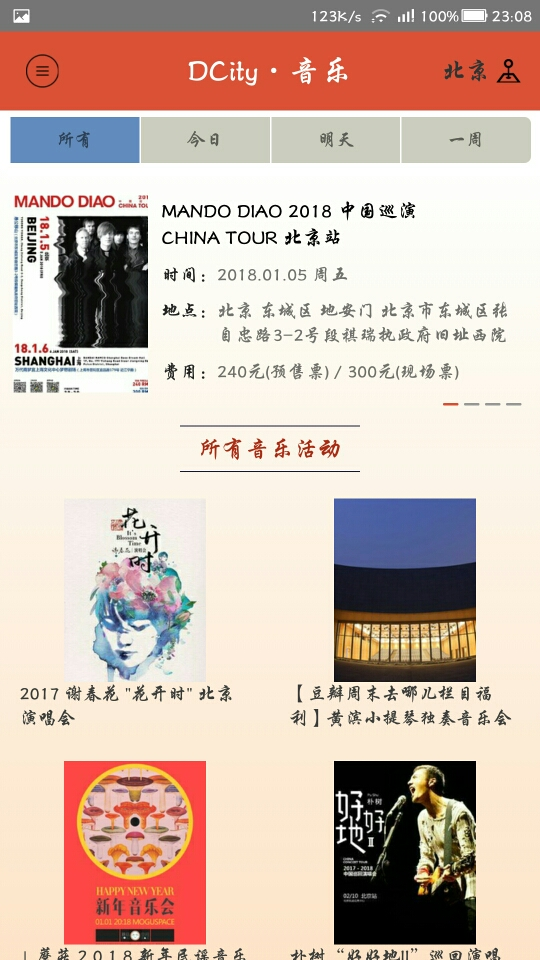
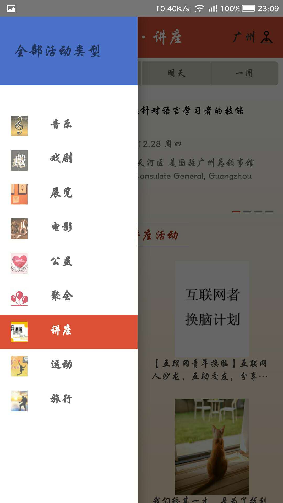
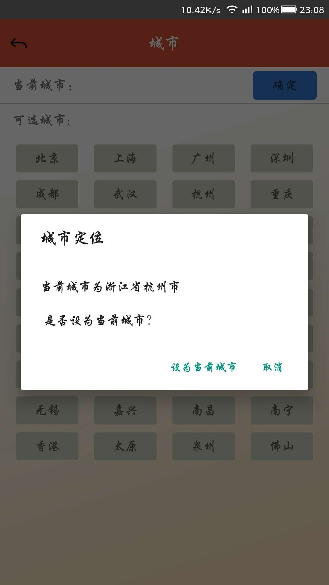

# DCity

React Native Application

###使用豆瓣开源API，通过 React Native 写的豆瓣同城项目。

 

### 功能：

 - 获取同城活动，根据指定类型，时间和地点获取。
 - 定位功能，获取城市位置信息。
 - 本地数据，城市获取后本地保存读取。
 - 查看活动详情，活动发起人以及与该发起人相关的所有活动。

 

### 第三方库：
 
 - **realm**： 实现本地存储。
 - **react-navigation**： 页面跳转和侧滑菜单。
 - **react-native-linear-gradient**： 实现背景色彩渐变。
 - **react-native-splash-screen**： 优化启动白屏的问题。
 - **react-native-root-toast**：  优化弹出框Toast。
 
 

### 效果图：

 

 

### 待优化：

 - 部分代码未匹配 iOS
 - 集成更多功能
